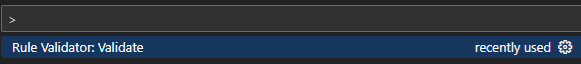

# Dynamic Rules Engine

.NET-based rules engine for externally defined rules based on C# LINQ expressions. It currently supports rules in YAML or JSON but could be exanded to support other formats.

**No releases yet - this project is in pre-alpha.**

```
# Global parameters
Parameters:
  - Name: DemoDate
    Expression: DateTime.Parse("2025-08-01")
  - Name: IsOldCar
    Expression: Auto.Age > 10
  - Name: HasRecentCollision
    Expression: Collisions.Any(c => c.VIN == Auto.VIN && c.Date > DemoDate.AddYears(-1))
Rules:
  - Id: rule_high_risk
    Condition: IsOldCar && HasRecentCollision
    Then: '"VIN: " + Auto.VIN + " High Risk"'
```
The project draws inspiration from Microsoft's [JSON Rules Engine](https://microsoft.github.io/RulesEngine), which similarly relies on C#-based rule definitions. The author created it to meet a specific need for an external DSL with rule dependencies (not easily achievable with the Microsoft project). 

Feature-wise, this engine mirrors many of the capabilites of the Microsoft project, including nested rules, scoped parameters (both local and global), and multiple inputs (concrete or annonyous types). It does not currently support dynamic (expando) inputs. Rules can also be dependent on other rules.

A word about YAML & JSON. At current writing this project is YAML centric in terms of documentation, samples, and unit tests. The author developed this project with YAML in mind, so at present JSON is a second class citizen.

The project includes a [Visual Studio Code extension](extension.md) that will dynamically parse your JSON or YAML rule expressions and hilite any parsing errors. This tool aids in development of rules providing a means to correct any syntax errors before running your rules in the context of your application. A caveat is it can only be used if you are using the rules engine with non-annonymous inputs.




